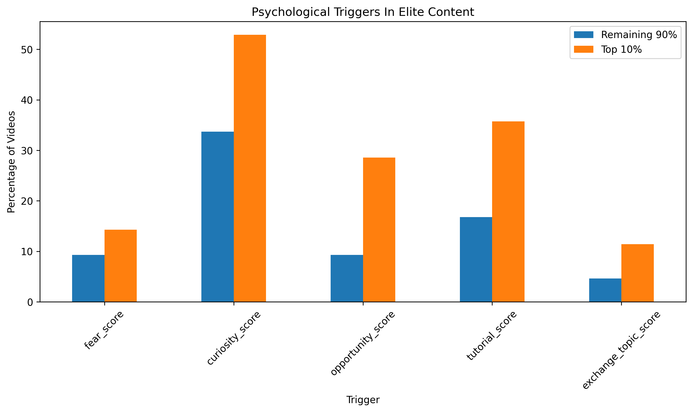
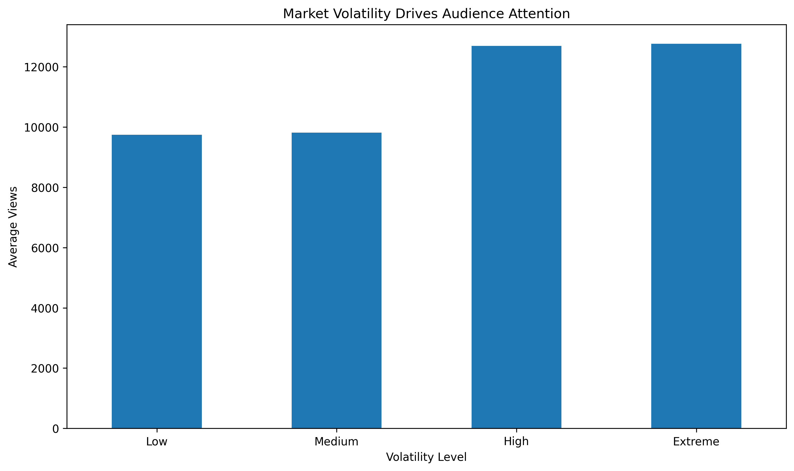
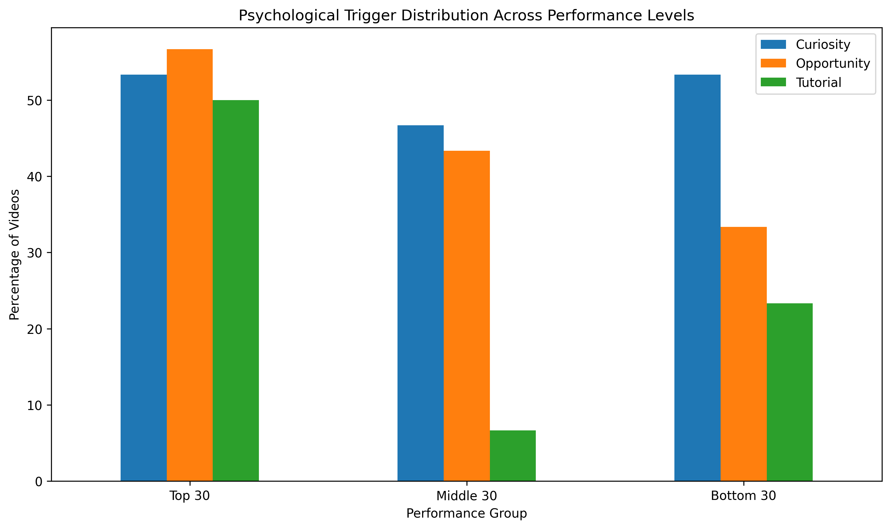

# Crypto YouTube Content Analysis

## Project Overview

This project analyzes 696 YouTube videos from the Crypto Stasiak channel to identify the factors most strongly associated with video performance.

The objective was to determine how title psychology, market conditions, educational content, and topic selection influence views, engagement, and audience behavior.

---

## Dataset

* 696 YouTube videos
* Video metadata
* Bitcoin market data
* Psychological title classifications
* Market regime and volatility classifications

---

## Tools Used

* Python
* Pandas
* Matplotlib
* Jupyter Notebook

---

## Analysis Areas

* Video performance
* Title psychology
* Market conditions
* Topic analysis
* Audience engagement
* Content strategy

---

## Key Findings

* Opportunity is the strongest content driver.
* Curiosity is the strongest click trigger.
* Tutorial content remains one of the most reliable content categories.
* Market volatility significantly increases audience demand.
* Exchange-related topics generate unusually high discussion and engagement.
* Combining psychological triggers improves performance.

---

## Key Visualizations

### Psychological Triggers In Elite Content



### Market Volatility Drives Audience Attention



### Psychological Trigger Distribution Across Performance Levels



---

## Deliverables

* Final Strategy Report (PDF)
* Executive Findings
* Content Playbook
* Visual Analysis
* Strategic Recommendations

---

## Project Structure

```text
data/
notebooks/
reports/
sql/
tableau/
```

---

## Outcome

The project developed a repeatable framework for designing high-performing crypto content using psychological triggers, educational value, and market context.
